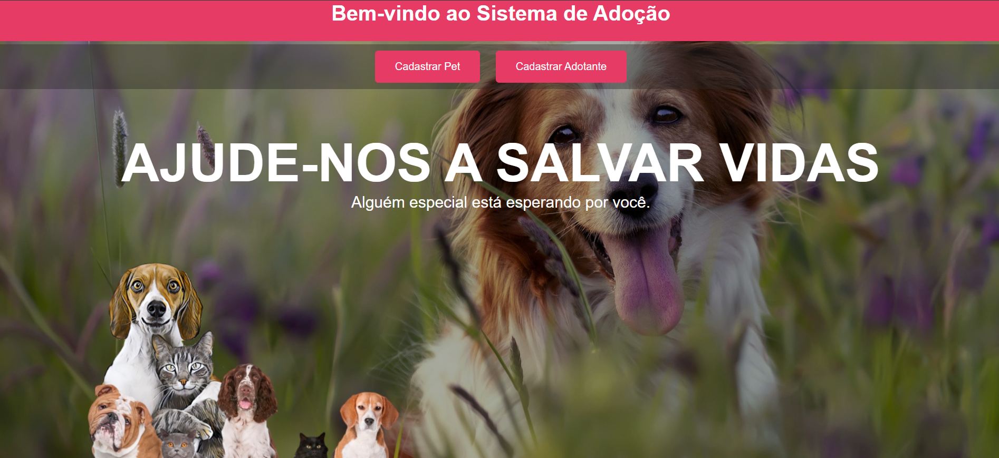
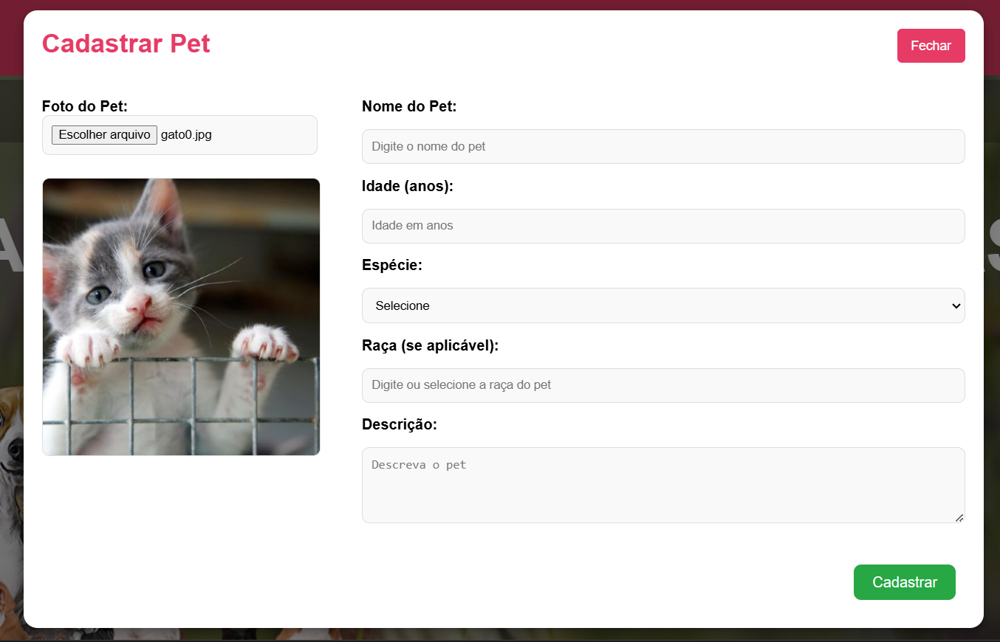
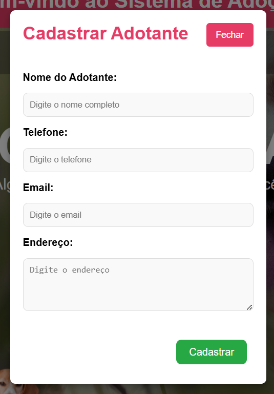
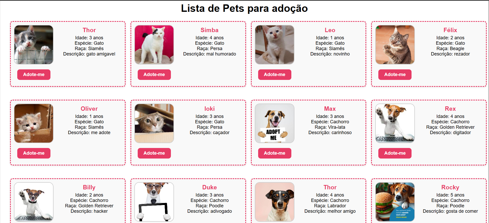
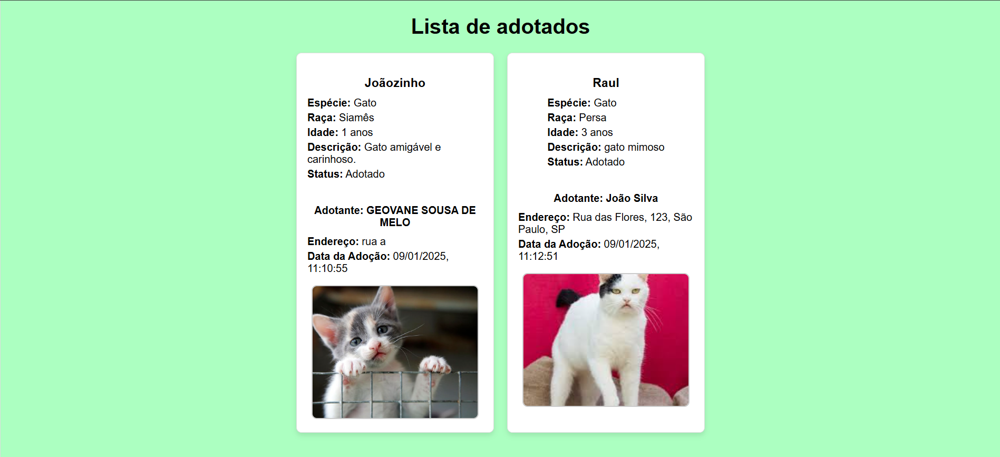
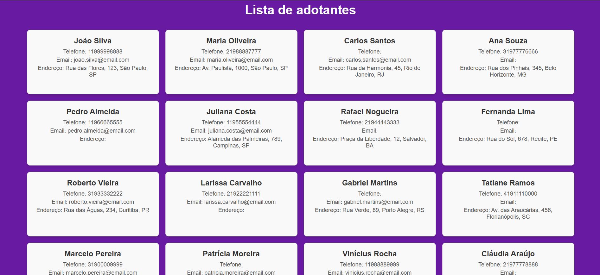

# Sistema de Adoção de Pets

**Sistema_adocao** é uma aplicação web para gerenciar o processo de adoção de animais. O sistema permite cadastrar e visualizar informações de pets, adotantes, bem como registrar adoções. Ele possui uma interface intuitiva e é dividido entre front-end, back-end e banco de dados.

## Tecnologias Utilizadas

### Front-End:
- **HTML**: Estrutura da página web.
- **CSS**: Estilização da interface.
- **JavaScript**: Funcionalidade interativa, incluindo o registro de adoções e interações com o back-end.

### Back-End:
- **Kotlin**: Linguagem utilizada no desenvolvimento da aplicação backend.
- **Spring Boot**: Framework utilizado para a criação da API RESTful.
- **IntelliJ IDEA**: IDE utilizada para o desenvolvimento da aplicação back-end.

### Banco de Dados:
- **PostgreSQL**: Banco de dados utilizado para armazenar informações sobre os pets, adotantes e adoções.

## Funcionalidades

1. **Cadastro de Pets**: Permite cadastrar novos pets no sistema, com informações como nome, idade, espécie, raça, foto e status.

##
   
2. **Cadastro de Adotantes**: Permite cadastrar adotantes, incluindo informações como nome, endereço e dados de contato.

##

3. **Lista de Pets**: Exibe todos os pets disponíveis para adoção, com a possibilidade de adotar um pet da lista. Após a adoção, o pet é movido para a lista de adotados.

##

4. **Lista de Adotados**: Exibe todos os pets que foram adotados, com informações sobre o adotante e data da adoção.

##

5. **Lista de Adotantes**: Exibe todos os adotantes registrados no sistema, permitindo a visualização de seus dados.

##

## Instalação e Execução
